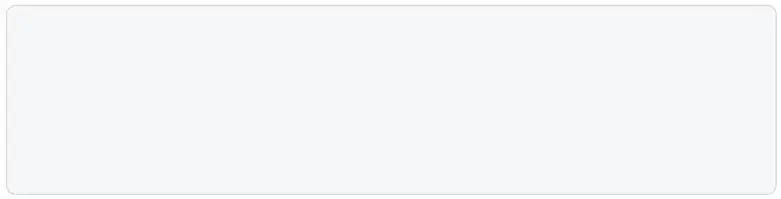

# EchoText


[](https://opensource.org/licenses/MIT)



```javascript
const typer = new EchoText([
  'Hello, thank you for using EchoText!',
  'This library helps you easily implement typewriter effects.',
  'Now add awesome typing effects to your website.'
], 70);

typer.on('update', ({ text, completedLines }) => {
  // Handle update your own UI with event listener
});

typer.start();
```

A lightweight TypeScript library that creates typewriter effects by displaying characters one by one, line by line. Perfect for creating engaging text animations on websites and applications.

## Features

- 🚀 Lightweight and dependency-free
- 📝 Type characters one by one with customizable speed
- ⏯️ Full control with start, pause, resume, and reset functions
- 🎯 Dynamic typing speed based on content
- 🌈 Event-based system for easy integration
- 📦 Written in TypeScript with full type definitions
- 🔄 Chainable API for elegant code

## Installation

### NPM
```bash
npm install echo-text
# or
yarn add echo-text
# or
pnpm add echo-text
```

## Usage

### Basic Example

```typescript
import { EchoText } from 'echo-text';

// Create an instance with text lines and speed (in milliseconds)
const et = new EchoText([
  'Welcome to EchoText!', 
  'This is a typewriter effect library.'
], 50);

// Listen for updates
et.on('update', ({ text, completedLines }) => {
  // Display completed lines
  if (completedLines.length > 0) {
    console.log(completedLines.join('\n'));
  }
  
  // Display current line being typed
  if (text) {
    console.log(text);
  }
});

// Start typing
et.start();
```

### Dynamic Speed

You can adjust typing speed dynamically based on the line content.

```typescript
const speedCalculator = (line: string): number => {
  if (line.includes('fast')) {
    return 20; // Type faster (20ms between characters)
  } else if (line.includes('slow')) {
    return 150; // Type slower (150ms between characters)
  }
  return 70; // Default speed
};

const et = new EchoText([
  'This types at normal speed.',
  'This types fast and shows quick typing!',
  'This types slow... notice how it appears more gradually...'
], speedCalculator);

et.start();
```

### Control Methods

```typescript
// Start typing
et.start();

// Pause typing
et.pause();

// Resume typing
et.resume();

// Stop typing
et.stop();

// Reset to beginning
et.reset();

// Add more lines dynamically
et.addLine('A new line added later.');
// Or add multiple lines
et.addLine([
  'First new line',
  'Second new line'
]);
```

### Events

```typescript
// Called whenever text is updated
et.on('update', ({ text, completedLines, lineIndex, charIndex }) => {
  console.log('Current text:', text);
});

// Called when a line is completed
et.on('line-complete', ({ line, lineIndex, completedLines }) => {
  console.log('Line completed:', line);
});

// Called when all lines are completed
et.on('complete', ({ completedLines }) => {
  console.log('All lines completed!');
});
```

## API Reference

### Constructor

```typescript
new EchoText(lines: string[], speed: number | SpeedCalculator)
```

- `lines`: Array of text lines to display
- `speed`: Either a fixed number (in milliseconds) or a function that takes a line and returns a typing speed

### Methods

| Method | Description | Returns |
|--------|-------------|---------|
| `start()` | Start the typing effect | `this` |
| `pause()` | Pause the typing effect | `this` |
| `resume()` | Resume a paused typing effect | `this` |
| `stop()` | Stop the typing effect | `this` |
| `reset()` | Reset to start from the beginning | `this` |
| `addLine(line: string \| string[])` | Add one or more lines to the queue | `this` |
| `getCurrentText()` | Get the current text being displayed | `string` |
| `getCompletedLines()` | Get all completed lines | `string[]` |
| `getStatus()` | Get the current status of the typing effect | `object` |
| `on(event, callback)` | Add an event listener | `this` |

### Events

| Event | Data | Description |
|-------|------|-------------|
| `update` | `{ text, char, lineIndex, charIndex, completedLines }` | Fired when text is updated |
| `line-complete` | `{ line, lineIndex, completedLines }` | Fired when a line is completed |
| `complete` | `{ completedLines }` | Fired when all lines are completed |

## Browser Support

EchoText works in all modern browsers:

- Chrome, Firefox, Safari, Edge (latest versions)
- IE11 with appropriate polyfills

## Using in Browser

### ESM (Recommended)

```html
<script type="module">
  import { EchoText } from './dist/echo-text.js';
  
  const et = new EchoText(['Hello, world!'], 50);
  // ...
</script>
```

### UMD

```html
<!-- Include the UMD bundle -->
<script src="./dist/echo-text.umd.js"></script>

<script>
    // Access via window.EchoText.EchoText
    const et = new window.EchoText.EchoText(['Hello, world!'], 50);
    // ...
</script>
```

## Examples

Check the `examples` directory for more examples and use cases.

## License

MIT License - see the LICENSE file for details.

## Contributing

Contributions are welcome! Please feel free to submit a Pull Request.

1. Fork the repository
2. Create your feature branch (`git checkout -b feature/amazing-feature`)
3. Commit your changes (`git commit -m 'Add some amazing feature'`)
4. Push to the branch (`git push origin feature/amazing-feature`)
5. Open a Pull Request